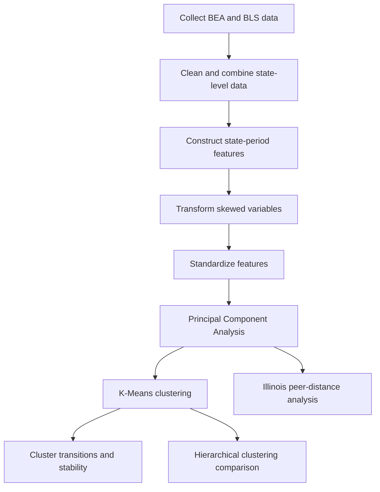

# State-Level Economic Similarity and Structural Stability

## An Unsupervised Learning Analysis of U.S. States Before, During, and After the 2020–2022 Economic Shock

This project examines similarities in the economic and industry-employment structures of the 50 U.S. states before, during, and after the 2020–2022 economic shock.

The analysis combines state-level economic indicators from the U.S. Bureau of Economic Analysis (BEA) and employment data from the U.S. Bureau of Labor Statistics (BLS). Principal Component Analysis (PCA), K-Means clustering, hierarchical clustering, cluster-transition analysis, and nearest-neighbor distances are used to identify structural similarities and changes across states.

This project was developed as part of my study of unsupervised machine learning in the IBM Machine Learning Professional Certificate program.

---

## Research Questions

1. Which states had similar economic and industry-employment structures before 2020?
2. How did structural similarities among states change during 2020–2022 and after 2022?
3. Which states remained stable, temporarily changed, or experienced a possible structural shift?
4. Which states were the closest economic peers of Illinois during each period?

---

## Study Periods

The data were aggregated into three research periods:

| Period | Years | Interpretation |
|---|---:|---|
| Baseline | 2015–2019 | Economic structure before the shock |
| Shock | 2020–2022 | Pandemic and economic-disruption period |
| Post-shock | 2023–2024 | Initial post-shock period |

> The post-shock period is shorter than the other periods and should therefore be interpreted as preliminary evidence rather than a definitive long-term structural outcome.

---

## Data Sources

### U.S. Bureau of Economic Analysis

The BEA Regional Economic Accounts were used to construct state-level measures such as:

- Real GDP per capita
- Real personal income per capita
- Real output per job
- Real average wages and salaries

Relevant BEA tables include:

- `SAGDP9` — Real GDP by state
- `SAINC1` — Personal income by state
- `SAINC30` — Economic profile by state

Source: [U.S. Bureau of Economic Analysis](https://www.bea.gov/data/by-place-state-territory)

### U.S. Bureau of Labor Statistics

BLS Quarterly Census of Employment and Wages data were used to calculate employment shares for selected industry groups.

The final structural features included:

- Manufacturing employment share
- Professional and business services employment share
- Healthcare employment share
- Natural resources and agriculture employment share

Source: [BLS Quarterly Census of Employment and Wages](https://www.bls.gov/cew/)

---

## Analytical Workflow



### 1. Data preparation

The original annual data were cleaned, standardized, and aggregated into state-period observations.

The final analytical dataset contained:

- 50 states
- 3 research periods
- 150 state-period observations
- 8 structural economic and employment features

### 2. Feature transformation

The natural-resources and agriculture employment share was strongly right-skewed. A `log1p` transformation was applied before standardization.

All features were standardized using `StandardScaler` because monetary variables and employment-share variables use different measurement scales.

### 3. Principal Component Analysis

PCA was used to reduce multicollinearity and summarize the eight structural variables.

Four principal components were retained. Together, they explained approximately **91.8% of the total standardized variance**.

General interpretations of the components were:

- **PC1:** Overall economic capacity, income, wages, and productivity
- **PC2:** Resource orientation versus professional-service orientation
- **PC3:** Healthcare and manufacturing structure
- **PC4:** Additional manufacturing–healthcare differentiation

### 4. K-Means clustering

K-Means models containing 2–8 clusters were evaluated using:

- Elbow/inertia analysis
- Silhouette score
- Calinski–Harabasz score
- Davies–Bouldin score
- Cluster-size balance
- Stability across random seeds

A seven-cluster solution was selected to balance statistical performance, stability, and economic interpretability.

The clusters should be interpreted as **descriptive economic-structure segments**, not permanent or definitive classifications.

---

## Economic-Structure Segments

| Cluster | Descriptive name |
|---:|---|
| 0 | High-Capacity Professional-Service Economies |
| 1 | Lower-Capacity Resource–Healthcare Economies |
| 2 | Balanced Manufacturing–Healthcare Economies |
| 3 | High-Capacity Resource-Specialized Economies |
| 4 | Very-High-Capacity Service–Healthcare Economies |
| 5 | Professional-Service Low-Healthcare Economies |
| 6 | Lower-Capacity Manufacturing-Intensive Economies |

Cluster numbers are model identifiers and do not represent a ranking from best to worst.

---

## Main Findings

### 1. Baseline economic similarities

Before 2020, states formed several interpretable groups based on economic capacity, productivity, wages, and industry-employment composition.

Illinois belonged to the **High-Capacity Professional-Service Economies** segment during the baseline period.

### 2. Changes during and after the shock

Most states remained in the same broad economic-structure segment.

However, some states changed cluster membership during the shock period, indicating that their relative position among states changed.

Because clustering measures relative similarity, a cluster change does not necessarily mean that the state experienced a complete economic transformation. It means that the state became more similar to another cluster profile based on the selected features.

### 3. Structural stability

The cluster-transition analysis found:

| Structural status | States | Percentage |
|---|---:|---:|
| Structurally stable | 40 | 80% |
| Possible shock-origin persistent shift | 9 | 18% |
| Possible post-shock shift | 1 | 2% |
| Temporary shock-period change | 0 | 0% |
| Complex or continuing transition | 0 | 0% |

The nine possible shock-origin persistent shifts were:

- California
- Colorado
- Kansas
- Michigan
- New Hampshire
- North Carolina
- Oregon
- Tennessee
- Washington

Maine showed a possible post-shock shift.

These classifications represent changes in descriptive cluster membership and should not be interpreted as causal evidence.

### 4. Illinois’s closest economic peers

Peer similarity was measured using Euclidean distance from Illinois in the four-dimensional PCA space:

\[
d_{IL,j} =
\sqrt{
(PC1_{IL}-PC1_j)^2+
(PC2_{IL}-PC2_j)^2+
(PC3_{IL}-PC3_j)^2+
(PC4_{IL}-PC4_j)^2
}
\]

The closest peer in all three periods was **New Hampshire**.

| Period | Five closest Illinois peers |
|---|---|
| Baseline: 2015–2019 | New Hampshire, Virginia, New Jersey, Maryland, Colorado |
| Shock: 2020–2022 | New Hampshire, New Jersey, Colorado, Maryland, Virginia |
| Post-shock: 2023–2024 | New Hampshire, New Jersey, Texas, Maryland, Delaware |

New Hampshire, New Jersey, and Maryland appeared among Illinois’s five closest peers in all three periods.

Illinois remained in the same broad cluster throughout the study, but its local peer neighborhood changed after 2022. This shows that broad cluster stability and changes in nearest-state relationships can occur simultaneously.

---

## Interpretation

The analysis suggests that differences among states were generally larger than differences among the three study periods.

Most states maintained relatively stable economic and employment structures. Nevertheless, the shock changed the relative structural position of several states, with most identified changes first appearing during 2020–2022 and remaining visible in the post-shock observations.

These results are descriptive. They identify patterns of similarity but do not establish that the 2020–2022 shock caused the observed structural changes.

---

## Visualizations

The project includes:

- Feature-distribution plots
- Correlation heatmaps
- PCA explained-variance analysis
- PCA loading tables
- State positions in PCA space
- K-Means evaluation plots
- U.S. cluster maps for all three periods
- Cluster-transition matrices
- Structural-stability summaries
- Illinois peer-comparison tables
- Hierarchical-clustering dendrograms

---

## Repository Structure

```text
notebooks/     Data preparation and modeling notebooks
data/          Processed data and analytical results
figures/       Exported charts and maps
reports/       Final project presentation or report
references/    Data-source documentation
```

---


## Methodological Limitations

- The post-shock period contains fewer years than the baseline period.
- Cluster assignments depend on the selected features, transformations, PCA specification, and number of clusters.
- K-Means creates discrete groups even when economic structures exist on a continuum.
- States close to a cluster boundary may change clusters following relatively small movements.
- PCA distance indicates multivariate similarity, not causal relationships.
- Period averages may hide important annual variation.
- The results should be interpreted as exploratory and descriptive.

---

## Technologies

- Python
- pandas
- NumPy
- SciPy
- scikit-learn
- Matplotlib
- Seaborn
- Plotly
- Jupyter Notebook

---

## Acknowledgment

OpenAI Codex, powered by GPT-5.6 Sol, was used as an educational assistant for coding guidance, debugging, methodological explanations, and documentation. All analytical decisions, interpretations, and final conclusions were reviewed and made by the author.

--- 

## Author

**Yuna Chou**

MBA graduate and project-management professional transitioning into data science and machine learning, with interests in economic modeling, econometrics, and computational research.

- GitHub: [yunachou05](https://github.com/yunachou05)

---

## License

This project is available under the MIT License.

The underlying BEA and BLS data remain subject to the terms and policies of their respective government agencies.